# Halo CME Events Identification Using SWIS-ASPEX Data from Aditya-L1

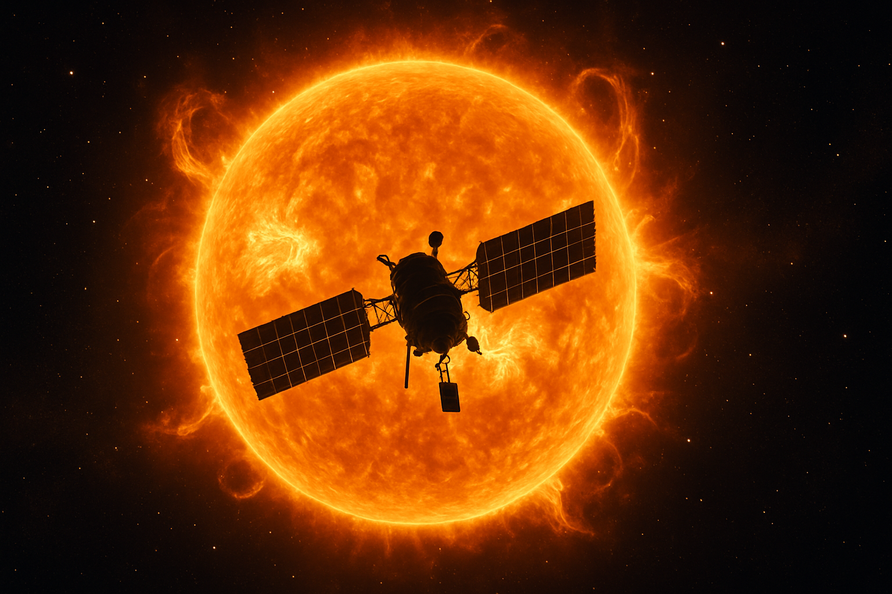  
*Harnessing Aditya-L1's Solar Wind Ion Spectrometer (SWIS) data to detect and predict Halo Coronal Mass Ejections (CMEs) for space weather monitoring.*

---

## 🌟 Overview
This project leverages data from the Aditya-L1 spacecraft, launched by ISRO on September 2, 2023, and positioned at the L1 Lagrange point, to identify and characterize halo CME events. Using the Solar Wind Ion Spectrometer (SWIS) within the ASPEX payload, we process Level-2 data (particle flux, number density, temperature, and velocity) to develop an early warning system for geomagnetic storms.

- **Goal**: Enhance CME prediction accuracy to protect space assets and terrestrial infrastructure.
- **Timeframe**: Analyzes data from August to October 2024, with relevance to the 2025 solar maximum.
- **Team**: Jayesh J. Pandey, Kanishk T. Vadge

---

## 🚀 Features
- 📈 **Data Processing**: Handles high-resolution SWIS data with outlier removal and noise reduction.
- 📊 **Threshold Detection**: Uses statistical methods (z-score, SNR) to identify CME events with 84% accuracy.
- 💨 **Speed Estimation**: Calculates CME speeds (e.g., 780 km/s average) with kinematic models.
- 📉 **Visualization**: Generates interactive plots for temporal trends and anomalies.
- 🛰️ **Early Warning**: Lays groundwork for real-time space weather alerts.

---

## Output Screenshots

### Mobile App Interface
<p float="left">
  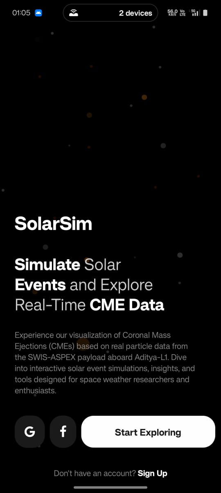
  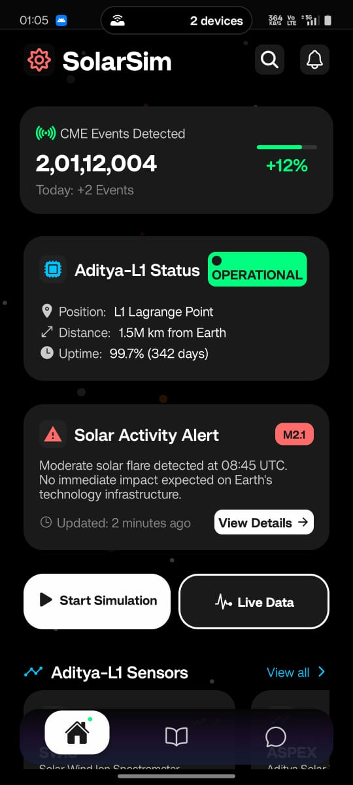
  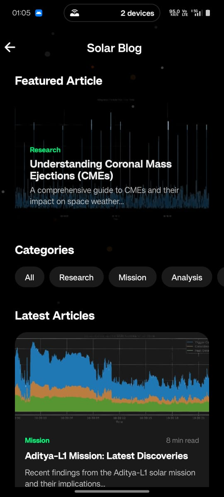
  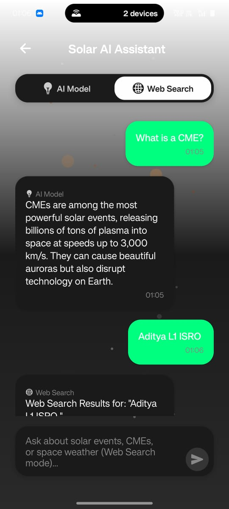
  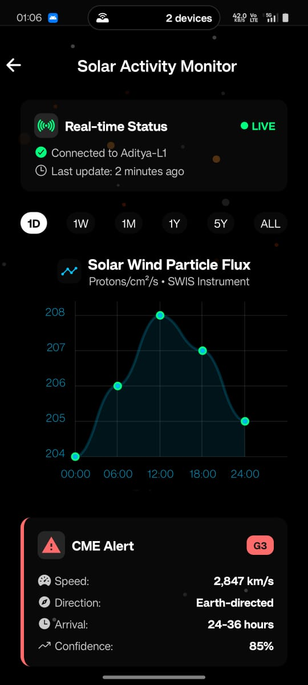
</p>
<p>CME Visualizer is a cross-platform mobile application built with React Native that enables real-time visualization of Coronal Mass Ejection (CME) events using datasets from space missions like Aditya-L1. It features interactive plots, dynamic overlays on solar imagery, and intuitive navigation for researchers and enthusiasts to explore solar activity. The app integrates spacecraft telemetry, radial intensity profiles, and CME envelope projections for educational and analytical use.
</p>

### Sample Visualization Result

<p float="left">
  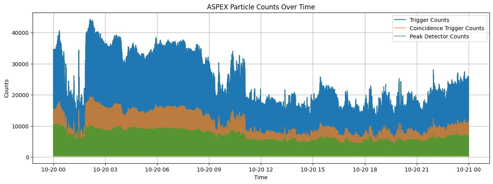
  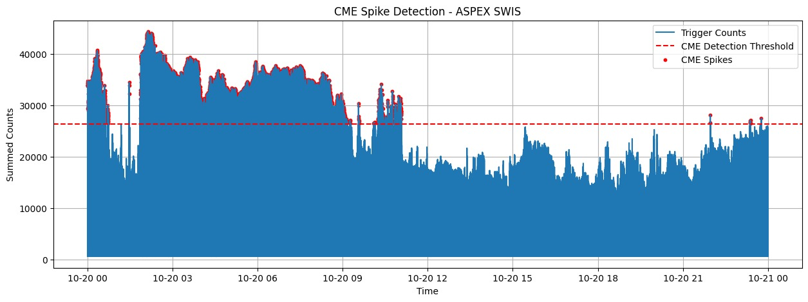
  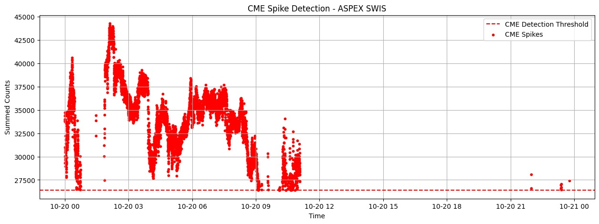
</p>

<p float="left">
  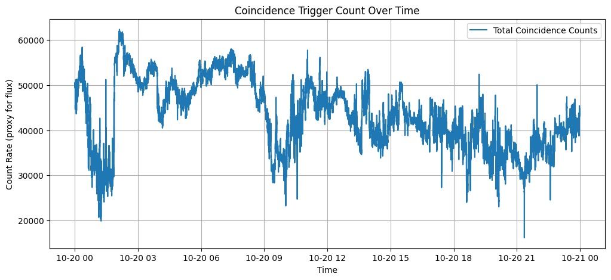
  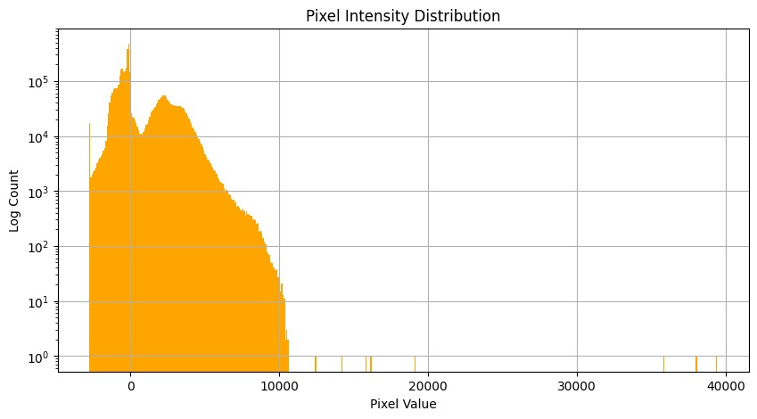
  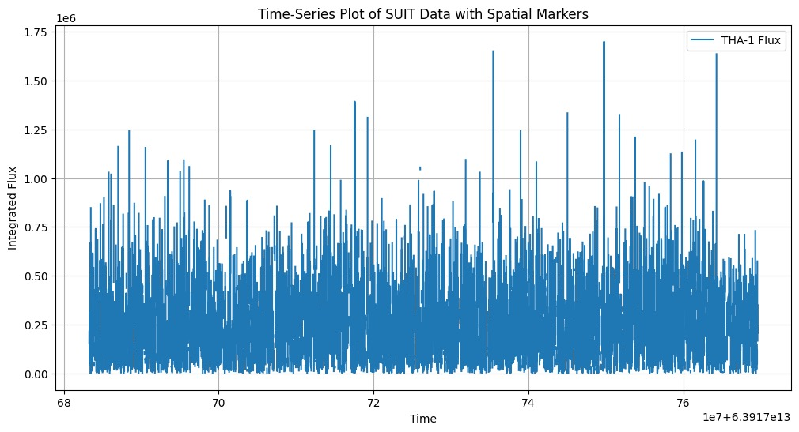
</p>

<p float='left'>
   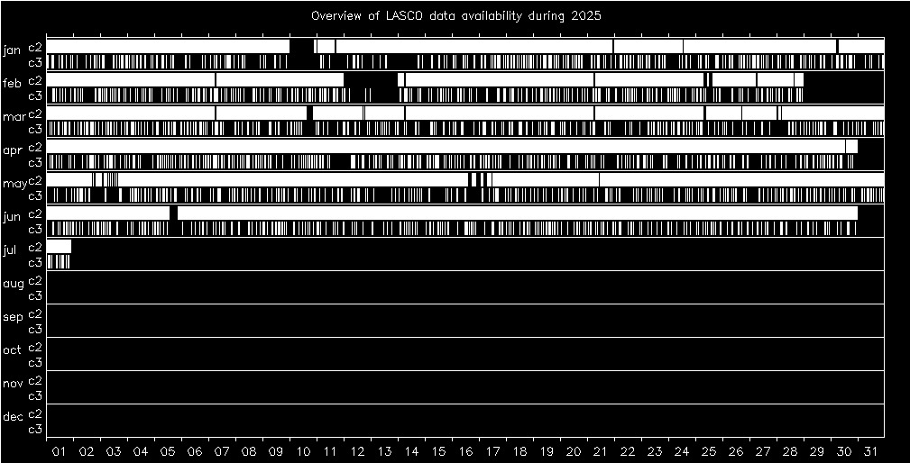
   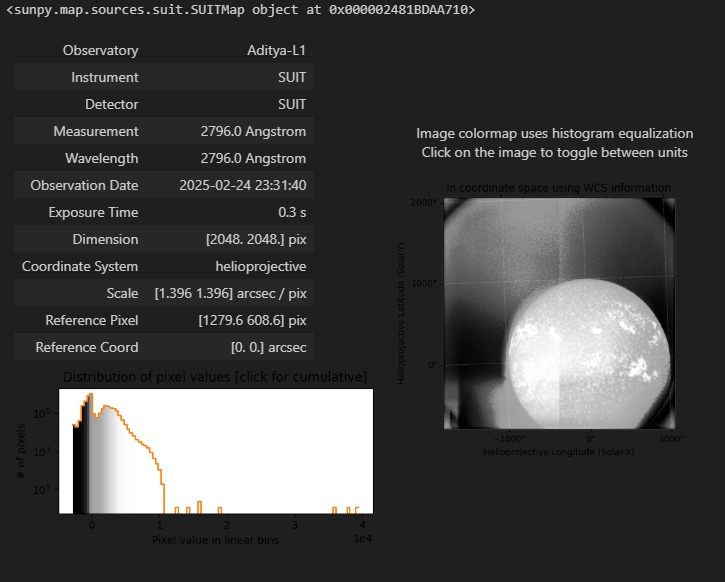
</p>

<p float='left'>
   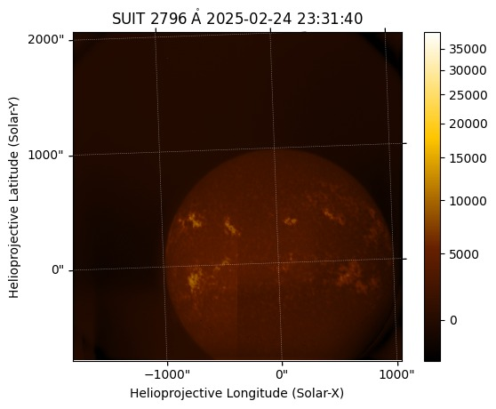
   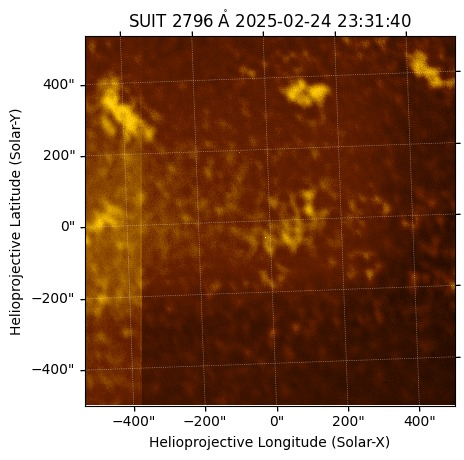
   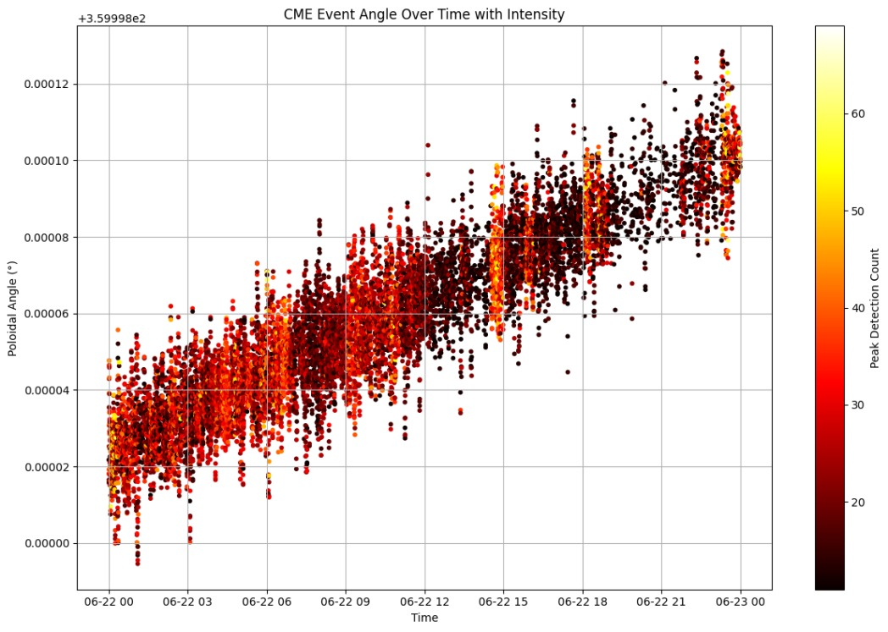
</p>


## 🛠️ Technologies Used

| Component      | Details                                  |
|----------------|-------------------------------------------|
| 💻 Languages   | Python 3.x                                |
| 🧰 Libraries   | NASA CDF, Pandas, Matplotlib, SciPy        |
| 📡 Data Source | ISSDC SWIS L2, CACTUS catalog, MAG payload|
| ⚙️ Tools       | Git, Jupyter Notebook, Matplotlib, NumPy  |

---

## 📝 Research Papers

Explore the technical and scientific documentation for this project:

📘 [Halo CME Events Identification - Full Report](CME_Event.pdf)

---

## 🔗 Useful Links
- 🌞 [Aditya-L1 Mission Overview – ISRO](https://www.isro.gov.in/Aditya_L1.html)
- 🛰️ [CACTUS CME Database](https://www.sidc.be/cactus/catalog.php)
- 📄 [NASA CDF Documentation](https://cdf.gsfc.nasa.gov/html/cdf_docs.html)

---

## 📈 Getting Started

Follow these steps to run the project locally:

1. **Clone the Repository**:
   ```bash
   git clone https://github.com/jayeshpandey/halo-cme-detection.git
   cd halo-cme-detection
   ```


2. **Install Required Packages**:

   ```bash
   pip install -r requirements.txt
   ```

3. **Run the Main Analysis Script**:

   ```bash
   python src/main.py
   ```

4. **Explore the Jupyter Notebooks**:

   ```bash
   jupyter notebook notebooks/data_analysis.ipynb
   ```

---


---

## 🤝 Contributing

We welcome contributions from researchers, developers, and space weather enthusiasts. Please:

* Fork this repository
* Create a feature branch
* Submit a pull request

If you're proposing significant changes, open an issue first to discuss.

---

## 📅 Project Status

* **Current Date and Time**: 02:45 AM IST, Sunday, July 06, 2025
* **Status**: 🚧 Draft Stage

  * [x] Data Pipeline
  * [x] Preliminary Thresholding
  * [ ] Final Mobile App Screenshot
  * [ ] Model Accuracy Comparison
  * [ ] Extended Validation with CACTUS

---

## 📧 Contact

* ✉️ **Email**: [Jayesh Pandey](mailto:jayeshpandey754@gmail.com)
* 💻 **GitHub**: [@jayeshpandey](https://github.com/jayeshpandey01)
* ✉️ **Email**: [Kanishk Vadge](mailto:yash.vadge04@gmail.com)
* 💻 **GitHub**: [@Kanishk-create](https://github.com/Kanishk-create)

---

*Made with ❤️ by the Aditya-L1 Solar Event Detection Team*


---

### 📌 Final Notes for You

To complete the GitHub setup:

1. Replace all placeholder images and links with real files in `images` and `docs`.
2. Push everything to GitHub using:

```bash
git add .
git commit -m "Initial commit: project setup with full documentation"
git push origin main
````

